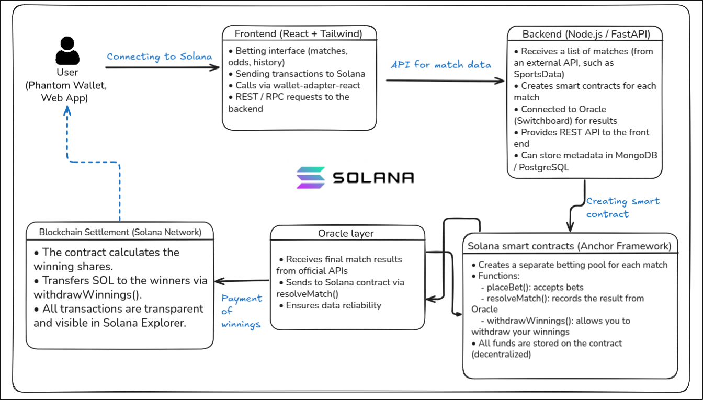

# Spofeai

Spofeai is a decentralized sports betting platform built on Solana that leverages AI-powered oracles to ensure transparent, trustless, and verifiable outcomes for sporting events.
Users can place bets on upcoming matches, and winnings are distributed automatically through smart contracts — no intermediaries, no centralized control.

## Problem
Traditional platforms (1xBet, etc.) are centralized:
- Users do not control their funds
- Commissions and delays in payments  
- No transparency: algorithms and odds are hidden
- Account blocking and unfair results are possible 

---

## Solution
**Spofeai** combines:
- **On-chain betting on Solana** with minimal fees
- **Phantom Wallet** for complete decentralization
- **Transparent payouts and transaction history** directly on the blockchain
- **AI match predictions** via ML model (FastAPI backend)    

## Architecture


---

## After MVP
1. **Интеграция ораклов Switchboard** — автоматическая проверка результатов матчей  
2. **P2P ставки (pool-based)** — пользователи ставят друг против друга  
3. **NFT-бейджи** — награды для лучших прогнозистов  
4. **Мобильное приложение** с нативным Solana SDK  
5. **DAO управление** — пользователи решают, какие матчи добавить  

---

## Installation and startup
Backend for ML predictions (FastAPI) 
```
cd backend
pip install -r requirements.txt
uvicorn main:app --reload
```

Frontend (React+Vite)
```
cd frontend
npm install
npm run dev
```